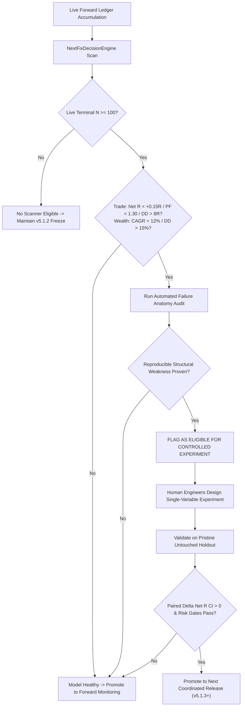

# Next-Fix Candidate Decision Dashboard & Governance Trigger

**Execution Date:** 2026-09-08 13:07:27 IST  
**Active Production Baseline:** **v5.1.2 (FROZEN)**  
**Authoritative Quality Registry:** `engine/analytics/scanner_quality_runtime.py`  
**Live Promotion Gate:** Strict $5$-Fold Standard (Requires $\text{LIVE\_FORWARD\_OOS\_TERMINAL\_N} \ge 100$)  
**System Authority Level:** **READ-ONLY (OBSERVE $\to$ FLAG $\to$ ANALYZE $\to$ RECOMMEND)**  

---

> [!NOTE]
> **CURRENT GOVERNANCE STATUS**: **No scanner is currently eligible for modification.**
> All scanners with live terminal counts below threshold are strictly frozen in evidence-accumulation mode to prevent sample contamination and overfitting.

---

## 1. Master Scanner Live vs Historical Ranking Matrix

| Scanner Engine | Historical Baseline (N) | Live Terminal OOS (N) | Mean Net R / CAGR | Net PF | Max DD | Health Profile | Next-Fix Eligibility |
| --- | --- | --- | --- | --- | --- | --- | --- |
| **`PULLBACK`** | 1134 | **0/100** | +0.705R | 2.36 | 9.17R | 🟢 PROMOTED (v5.1.2 Active) | INELIGIBLE (Recently Upgraded) |
| **`MULTIBAGGER`** | 816 | **0/100** | +0.185R | 1.30 | 7.16R | 🟢 HEALTHY (Convex Edge Verified) | INELIGIBLE (Model Healthy) |
| **`WEALTH_ENGINE`** | 1726 | **0/100** | +14.70% CAGR | 1.85 (CAGR/DD) | 9.53% | 🟢 HEALTHY (Portfolio Growth Validated) | INELIGIBLE (Model Healthy) |
| **`EOD`** | 3 | **0/100** | +1.119R | ∞ | 0.00R | 🟡 ACCUMULATING LIVE OOS (0/100) | INELIGIBLE (Live N < 100) |
| **`DAILY_BUILDER`** | 10 | **0/100** | +0.433R | 1.81 | 2.13R | 🟡 ACCUMULATING LIVE OOS (0/100) | INELIGIBLE (Live N < 100) |
| **`MULTI_TF`** | 5 | **0/100** | +0.167R | 1.27 | 3.10R | 🟡 ACCUMULATING LIVE OOS (0/100) | INELIGIBLE (Live N < 100) |
| **`REVERSAL`** | 1 | **0/100** | -1.032R | 0.00 | 1.03R | 🟡 ACCUMULATING LIVE OOS (0/100) | INELIGIBLE (Live N < 100) |

---

## 2. Operational Directives & Next Action per Scanner

| Scanner Engine | Governance Model | Current State | Prescribed Operational Action |
| :--- | :--- | :--- | :--- |
| **`PULLBACK`** | Trade-Level Net R | **v5.1.2 Active** | Continuous real-world paired $\Delta\text{Net R}$ tracking against v5.1.1 fixed $4.0\%$ shadow control. |
| **`MULTIBAGGER`** | Trade-Level Net R | **v5.1.1 Frozen** | Maintain frozen base accumulation geometry ($6.0\%$ SL, $3.0R$ target); forward monitoring. |
| **`WEALTH_ENGINE`** | Portfolio CAGR / DD | **v5.1.1 Frozen** | Governed under separate portfolio CAGR/DD contract; monitor monthly equity trajectory. |
| **`EOD`** | Trade-Level Net R | **Hold Frozen (0/100 Live)** | Strictly accumulate real live terminal OOS observations; prohibit parameter tuning. |
| **`DAILY_BUILDER`** | Trade-Level Net R | **Hold Frozen (0/100 Live)** | Strictly accumulate real live terminal OOS observations; prohibit parameter tuning. |
| **`MULTI_TF`** | Trade-Level Net R | **Hold Frozen (0/100 Live)** | Strictly accumulate real live terminal OOS observations; prohibit parameter tuning. |
| **`REVERSAL`** | Trade-Level Net R | **Hold Frozen (0/100 Live)** | Diagnostic monitoring only; investigate support confluence before designing experiments. |

---

## 3. Strict 5-Fold Governance Decision Loop (Necessary & Sufficient Standard)

